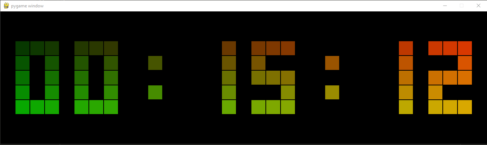

# Пиксельные часы с градиентом



## Идея:
Данный проект позволяет вывести системное время в отдельном окне, с возможностью кастомизации

## Установка:

Клонирование проекта:
``` shell
git clone https://github.com/KlimentFis/Pygame_clock.git
```

Переход в папку проекта:
``` shell
cd Pygame_clock
```

Установка виртуального окружения и активация виртуального окружения(Не обязательно):
``` shell
python -m venv venv && venv\Scripts\activate
```

Установка зависимостей:
``` shell
pip install pygame
```

Запуск проекта:
``` shell
python main.py
```

## Настройка:
*Настройка данного проекта производится с помощью JSON файла, там можно выставить нужные вам настройки, для кастомизации проекта*

### Установка параметров:
| Параметр | Назначение |
|:------: | :------------: |
| Size | Размер 1-го эллемента в пикселях |
| Circle | Использовать кружочки, вместо квадратов ( 1/0 - Да / Нет ) |
| AM | Использовать Американский, 12-ти часовой формат ( 1/0 - Да / Нет ) |
| Seconds | Выводить секунды на циферблате ( 1/0 - Да / Нет ) |

### Базовые настройки часов:
```json
{
    "Clock":
    {
        "Size": 35,
        "Circle": 0,
        "AM": 0,
        "Seconds": 0
    }
}
```